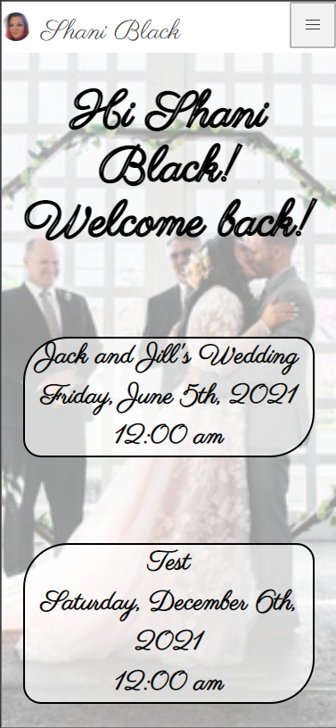
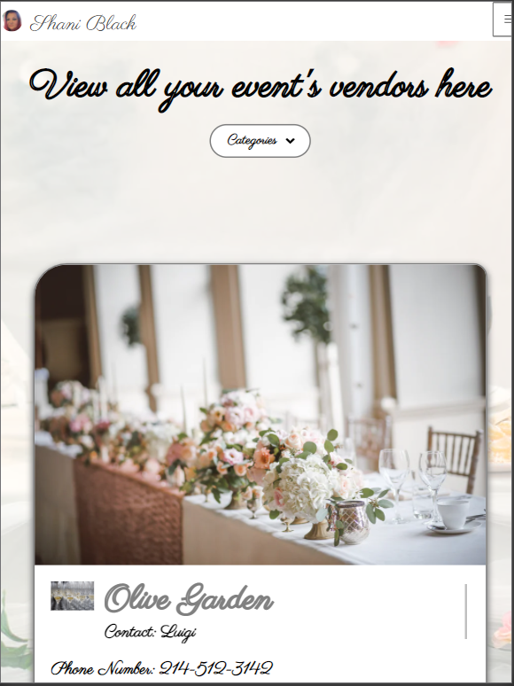

# To the Altar

## Description
To the Altar is an application used by wedding planners to be able to store and add information into a database. Multiple events can be created and multiple vendors within each event can be added, updated, and deleted. Users are able to login securely, using their Google profiles, if they choose.

Here are some of the technologies that were used to the create this program:
HTML,JavaScript,CSS,node.js,inquirer,path,MySQL,Bulma
    
## Table of Contents
* [Usage](#usage)
* [Contributing](#contributing)
* [Tests](#tests)
* [Live_Links](#live_links)
* [Questions](#questions)
* [License](#license)
    
## Usage
This project is used for someone planning a wedding to store all the planning details in one place.

## Contributing
Shani Black [GitHub](https://github.com/ShaniBlack)

Ryan Henson [GitHub](https://github.com/Ryan-Henson)

Robert Santos [GitHub](https://github.com/robertsantos-dfw)

## Live_Links
GitHub [link](https://github.com/ShaniBlack/TotheAltar)

Deployed site [link](https://enigmatic-taiga-25038.herokuapp.com/)

## Questions
Please feel free to find me on GitHub: [ShaniBlack](https://github.com/ShaniBlack)
You can also [email](shaniblack2004@gmail.com) me with any questions.
    
## License
This application is covered by the MIT License license.
  